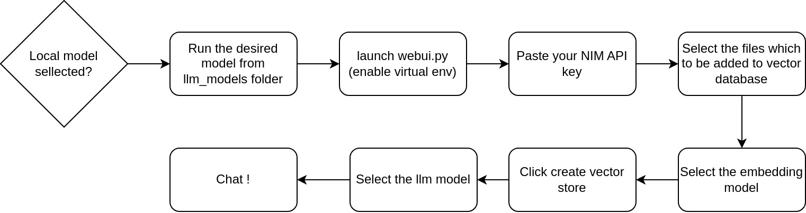

# RAG Application for NVIDIA Jetson Modules

## Overview
This program provides a streamlined testing environment for Retrieval-Augmented Generation (RAG) on NVIDIA Jetson modules. It facilitates easy experimentation with different RAG configurations and local LLM models. You can choose the embedding and llm model which you want to test. The program flowchart is as follows:

## How to get NIM API Key (free)
1. Go to https://build.nvidia.com/explore/discover
2. From top right of the page create new account.
3. Apply for 5000 api credits with your student or company mail